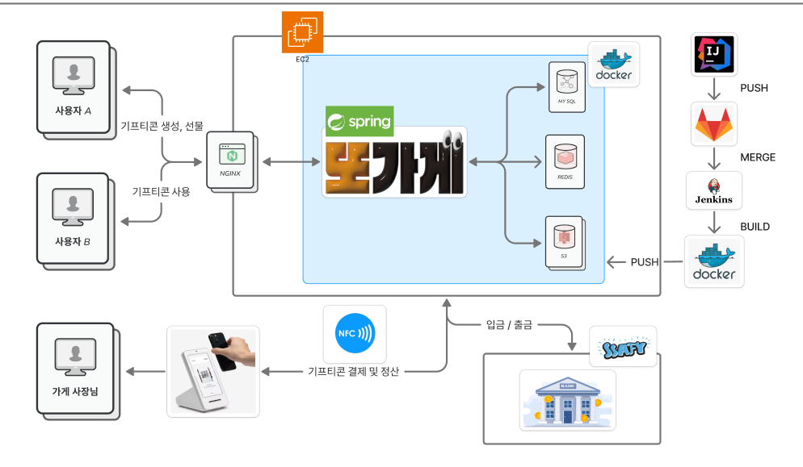

 

## 📌 목차
1. [프로젝트 소개](#-프로젝트-소개)
2. [팀 소개](#dddd)
3. [주요 기능](#-주요-기능)
4. [시연 영상](#-시연-영상)
5. [주요 기술](#-주요-기술)
6. [기술 아키텍처](#-기술-아키텍처처)
7. [프로젝트 구조](#-프로젝트-구조)
8. [산출물](#-산출물)
    

## 🚀 프로젝트 소개

***SSAFY 12기 2학기 공통 프로젝트***

> ⌛ 프로젝트 기간 : 2025.02.28 ~ 2025.04.11 (6주)

> 📆 상세 기간 : 기획 2주 + 개발 3주 + 버그 해결 1주

> 🔗 [노션 링크](https://relic-sea-1e3.notion.site/1a412a0174e780b4870bd63cd477cac6)

> 📲 [배포 URL - 모바일](https://j12e106.p.ssafy.io)

> 📝 [발표 자료](https://www.canva.com/design/DAGj4Cf_xWE/_Rcu9Lm_w1HBxPY1ytvvGQ/view?utm_content=DAGj4Cf_xWE&utm_campaign=designshare&utm_medium=link2&utm_source=uniquelinks&utlId=h840401bd48)

### 
**✨ 로컬 기프티콘 개인화 서비스** 
비대면 선물 문화가 일상이 된 시대에, 누구나 손쉽게 원하는 매장의 기프티콘을 생성하고 선물할 수 있는 자체 페이 기반 서비스를 구축하는 것을 목표로 합니다.
본 프로젝트는 기존처럼 기업이 아닌 일반 개인이 직접 기프티콘을 제작하고, 친구나 지인에게 선물할 수 있는 환경을 제공하여 소상공인 매장의 접근성과 선물 문화의 다양성을 동시에 확대합니다.
이를 통해 사용자는 복잡한 절차 없이 간편하게 결제 수단을 선물하고, 가맹점은 별도의 인프라 없이 디지털 고객을 확보할 수 있는 상호 혜택 구조를 실현하고자 합니다.

**😻 NFC 결제** 

**💪 이런 사람 사용해보세요!** 
1️⃣ 부모님께 효도하고 싶어요! 
2️⃣ 생일인 친구에게 특별한 선물하고 싶어요! 
3️⃣ 친구들과 맛집을 공유하고 싶어요! 
4️⃣ 나만의 메뉴를 만들고 싶어요! 

## 👥 팀 소개
<table style="text-align: center;" width="100%">
  <tr>
    <th style="text-align: center;" width="16.66%"></th>
    <th style="text-align: center;" width="16.66%"></th>
    <th style="text-align: center;" width="16.66%"></th>
    <th style="text-align: center;" width="16.66%"></th>
    <th style="text-align: center;" width="16.66%"></th>
    <th style="text-align: center;" width="16.66%"></th>
  </tr>
  <tr>
    <td style="text-align: center;" width="16.66%">천세윤 <a href="https://github.com/yooniverse7">@yooniverse7</a></td>
    <td style="text-align: center;" width="16.66%">민상기 <a href="https://github.com/Steadystudy">@Steadystudy</a></td>
    <td style="text-align: center;" width="16.66%">정영한 <a href="https://github.com/ynghan">@ynghan</a></td>
    <td style="text-align: center;" width="16.66%">이상혁 <a href="https://github.com/leesanghyeok523">@leesanghyeok523</a></td>
    <td style="text-align: center;" width="16.66%">최진문 <a href="https://github.com/jinmoon23">@jinmoon23</a></td>
    <td style="text-align: center;" width="16.66%">신주환 <a href="https://github.com/yurai770">@yurai770</a></td>
  </tr>
  <tr>
    <td style="text-align: center;" width="16.66%">백엔드 개발   (팀장)</td>
    <td style="text-align: center;" width="16.66%">프론트 개발</td>
    <td style="text-align: center;" width="16.66%">인프라 개발</td>
    <td style="text-align: center;" width="16.66%">백엔드 개발</td>
    <td style="text-align: center;" width="16.66%">프론트 개발</td>
    <td style="text-align: center;" width="16.66%">백엔드 개발</td>
  </tr>
  <tr>
    <td style="text-align: center;" width="16.66%">페이 도메인, 은행 서버 및 금융망 API, 포스 시스템</td>
    <td style="text-align: center;" width="16.66%">지도 및 NFC, QR 결제 담당</td>
    <td style="text-align: center;" width="16.66%">인프라 CI/CD 구축, 기프티콘 API, 지라 관리</td>
    <td style="text-align: center;" width="16.66%">맛집 API, 크롤링, Redis, S3, 소셜로그인, AI 서빙 (Stable diffusion)</td>
    <td style="text-align: center;" width="16.66%">React-Native 관련 통신 및 기프티콘 생성, 마이페이지 담당</td>
    <td style="text-align: center;" width="16.66%">NFC 기능, Spring Security, POS 기기 구현</td>
  </tr>
</table>

## 🚀 주요 기술

### [FE]
- Next.js: React 기반의 프레임워크, 서버 사이드 렌더링(SSR)과 정적 사이트 생성(SSG)을 활용하여 성능 최적화. RN의 WebView 라이브러리를 통해 웹앱 구현에 활용
- React-native(RN): : TypeScript와 React를 활용해 Android 네이티브 앱을 개발에 활용. Permission 라이브러리로 필요한 권한 획득 및 핵심 기능인 NFC 결제 기능 구현.
- TypeScript: 코드의 안정성 및 유지 보수성을 높이는 강력한 타입 시스템 제공
- React-query: 서버 상태 관리를 위한 라이브러리로, 데이터 페칭, 캐싱, 동기화, 업데이트를 간편하고 효율적으로 처리.
- Zustand: 간단하고 확장 가능한 클라이언트 상태 관리 라이브러리로, axiosInstance 구성 시 accessToken 전역 상태 관리를 통해 간편한 비동기 통신 구현.
- TailwindCSS: 유틸리티 클래스 기반 CSS 프레임워크로, 빠르고 일관된 UI 개발에 활용.
- Shadcn: 기존 컴포넌트 라이브러리와 달리 고유한 "복사 및 붙여넣기" 방식을 채택,  전체 라이브러리를 종속성으로 설치하는 대신 필요한 컴포넌트만 선택적으로 프로젝트에 직접 커스터마이징 및 적용에 활용
- Axios: Promise 기반의 HTTP 클라이언트 라이브러리로, 비동기 요청과 API 통신을 간편하게 처리.

### [BE]

<strong>생성형 이미지 처리</strong>

- **목표:**  
  사용자 맞춤 기프티콘 이미지를 생성하고, Amazon S3에 저장하여 클라우드에서 제공하는 서비스 구축.

- **기술 스택:**
   - **Stable Diffusion:** 이미지 생성 딥러닝 모델
   - **GPT-4o (또는 최신 GPT 모델):** 동적 프롬프트 생성을 위한 언어 모델
   - **FastAPI & LangChain:** API 엔드포인트와 서비스 통합
   - **PyTorch 최적화:** `torch.float16` 사용 및 4비트 양자화 적용
   - **Amazon S3:** 생성된 이미지의 클라우드 스토리지

### 초기 문제점

1. **이미지 퀄리티:**
   - 자체 하드코딩된 프롬프트를 사용했을 때 생성되는 이미지의 품질이 낮아, 사용자 만족도가 10장 중 1~2장 정도에 머물렀음.

2. **속도 및 리소스 사용:**
   - GPU 서버에서 실행 중에도 이미지 생성 시간이 90~100초 정도 소요되었고, 모델의 메모리 사용량이 매우 높았음.

### 해결 방안

1. **프롬프트 생성 개선:**
   - **동적 프롬프트 생성:**  
     GPT-4o, FastAPI, LangChain을 활용하여 사용자 입력에 맞는 동적 프롬프트를 생성하도록 변경.
      - 기존 정적인 프롬프트 대신, GPT 기반의 프롬프트 생성으로 사용자 만족도가 10장 중 9~10장으로 향상됨.
   - **캐싱된 프롬프트 파일 활용 (옵션):**  
     비용과 속도 개선을 위해 미리 작성된/캐싱된 프롬프트 파일을 사용하도록 구현 가능 (예: `cached_prompts/prompt_축하.txt`).

2. **모델 최적화:**
   - **데이터 타입 최적화:**
      - 기존 `torch.float32` 대신 `torch.float16` 사용하여 GPU 추론 속도를 향상시키고 메모리 사용량을 줄임.
   - **4비트 양자화:**
      - BitsAndBytes 라이브러리의 `BitsAndBytesConfig`를 사용해 모델의 transformer 부분을 4비트 양자화하여 리소스 사용량을 대폭 줄임.
      - 이를 통해 이미지 생성 시간이 기존의 90~100초에서 10~13초로 단축됨.

### 개선 결과

- **이미지 생성 속도 개선:**
   - 최적화를 통해 90 ~ 100초였던 생성 시간이 10 ~ 13초로 단축됨.

- **이미지 품질 향상:**
   - GPT 기반 동적 프롬프트로 사용자 만족도가 10장 중 1~2장에서 9~10장으로 향상됨.

- **리소스 효율성 증대:**
   - `float16`과 4비트 양자화를 적용하여 GPU 메모리 사용량이 감소, 동일 서버에서 더 많은 작업을 동시에 처리할 수 있게 됨.

## 🚀 주요 기능

<strong>기프티콘 커스텀</strong>

<table style="text-align: center;" width="100%">
  <tr>
    <th style="text-align: center;" width="25%">기프티콘 커스텀 페이지</th>
    <th style="text-align: center;" width="25%">받은 선물함 페이지</th>
    <th style="text-align: center;" width="25%">보낸 선물함 페이지</th>
    <th style="text-align: center;" width="25%">기프티콘 지도 페이지</th>
  </tr>
  <tr>
    <td style="text-align: center;" width="25%"></td>
    <td style="text-align: center;" width="25%"></td>
    <td style="text-align: center;" width="25%"></td>
    <td style="text-align: center;" width="25%"></td>
  </tr>
</table>

<strong>결제 기능</strong>

<table style="text-align: center;" width="100%">
  <tr>
    <th style="text-align: center;" width="33%">결제 방식 선택 페이지</th>
    <th style="text-align: center;" width="33%">NFC</th>
    <th style="text-align: center;" width="33%">QR 코드</th>
  </tr>
  <tr>
    <td style="text-align: center;" width="33%"></td>
    <td style="text-align: center;" width="33%"></td>
    <td style="text-align: center;" width="33%"></td>
 </tr>
</table>

<strong>맛집 등록</strong>

<table style="text-align: center;" width="100%">
  <tr>
    <th style="text-align: center;" width="20%">맛집 지도 화면</th>
    <th style="text-align: center;" width="20%">맛집 등록 화면</th>
    <th style="text-align: center;" width="20%">나만의 메뉴</th>
    <th style="text-align: center;" width="20%">또갈집 지도 화면</th>
    <th style="text-align: center;" width="20%">또갈집 확인 화면</th>
  </tr>
  <tr>
    <td style="text-align: center;" width="20%"></td>
    <td style="text-align: center;" width="20%"></td>
    <td style="text-align: center;" width="20%"></td>
    <td style="text-align: center;" width="20%"></td>
   <td style="text-align: center;" width="20%"></td>
  </tr>
</table>

## 🔧 기술 스택

<strong>백엔드 스택</strong>

 
### ☕ Java 17
최신 LTS 버전의 Java를 기반으로, 높은 성능과 안정성을 갖춘 백엔드 애플리케이션 구현에 활용.  
Record, Switch Expression 등의 현대적인 문법을 통해 코드 가독성과 개발 생산성 향상.

---

### 🚀 Spring Boot 3.4.3  
REST API, 스케줄링, 예외 처리, 검증 등의 기능을 빠르고 효율적으로 구현할 수 있도록 지원하는 프레임워크.  
프로젝트 구조와 의존성 관리를 표준화하여 유지보수성 향상.

---

### 🔐 Spring Security  
JWT 기반의 인증 및 인가를 위해 커스텀 필터(`CustomAuthenticationFilter`)와 사용자 정의 토큰(`CustomAuthToken`)을 활용하여 보안 처리 구현.

---

### 🧩 Spring Data JPA  
객체지향적인 방식으로 DB에 접근하며, 복잡한 쿼리도 메서드 정의만으로 간편하게 처리.  

---

### 🗄️ MySQL  
대중적이고 안정적인 관계형 데이터베이스.  
다양한 인덱스 전략과 트랜잭션 기능을 활용하여 데이터 정합성과 성능을 확보.  
테이블 간 관계(ERD)를 기반으로 유저-식당-메뉴 간의 구조적 설계 구성.

---

### ⚡ Redis  
인증 토큰, 알림 캐시, 인기 맛집 데이터 등의 임시 저장소로 활용.  
빠른 읽기/쓰기 속도를 바탕으로 실시간 사용자 경험 개선.

---

### 🗂️ AWS S3  
사용자 커스텀 메뉴 이미지 및 식당 이미지 저장소로 사용.  
`Pre-signed URL`을 통해 보안성을 확보하며, 대용량 정적 파일 업로드/다운로드 처리에 활용.

---

### 📦 Docker  
로컬 개발 환경과 배포 환경의 일관성을 확보하기 위해 모든 구성 요소를 컨테이너화하여 관리.

---

### 🔁 Jenkins  
GitLab 연동을 통해 자동화된 CI/CD 파이프라인을 구축.  
코드 커밋 시 자동 빌드 및 배포를 통해 개발 효율성과 안정성 강화.

---

### 🌐 Nginx  
정적 리소스 제공 및 리버스 프록시 서버로 활용.  
API 요청 라우팅, SSL 인증서 설정, 로드밸런싱 등 웹 서버 최적화 구성에 기여.

## 🗺️ 기술 아키텍처

## 📂 프로젝트 구조

  
<strong>Back 폴더 구조 보기</strong>

  <pre>
📦 main  
 ┣ 📂 java  
 ┃ ┗ 📂 com  
 ┃   ┗ 📂 example  
 ┃     ┗ 📂 ddo_pay  
 ┃       ┣ 📂 client  
 ┃       ┣ 📂 common  
 ┃       ┃ ┣ 📂 config  
 ┃       ┃ ┃ ┣ 📂 redis  
 ┃       ┃ ┃ ┣ 📂 rest  
 ┃       ┃ ┃ ┣ 📂 S3  
 ┃       ┃ ┃ ┗ 📂 security  
 ┃       ┃ ┃   ┗ 📂 token  
 ┃       ┃ ┣ 📂 dto  
 ┃       ┃ ┣ 📂 exception  
 ┃       ┃ ┣ 📂 response  
 ┃       ┃ ┗ 📂 util  
 ┃       ┣ 📂 gift  
 ┃       ┃ ┣ 📂 controller  
 ┃       ┃ ┣ 📂 dto  
 ┃       ┃ ┃ ┣ 📂 create  
 ┃       ┃ ┃ ┣ 📂 select  
 ┃       ┃ ┃ ┗ 📂 update  
 ┃       ┃ ┣ 📂 entity  
 ┃       ┃ ┣ 📂 repository  
 ┃       ┃ ┗ 📂 service  
 ┃       ┃   ┗ 📂 impl  
 ┃       ┣ 📂 pay  
 ┃       ┃ ┣ 📂 controller  
 ┃       ┃ ┣ 📂 dto  
 ┃       ┃ ┃ ┣ 📂 bank_request  
 ┃       ┃ ┃ ┣ 📂 bank_response  
 ┃       ┃ ┃ ┣ 📂 finance  
 ┃       ┃ ┃ ┣ 📂 request  
 ┃       ┃ ┃ ┗ 📂 response  
 ┃       ┃ ┣ 📂 entity  
 ┃       ┃ ┣ 📂 finance_api  
 ┃       ┃ ┣ 📂 repository  
 ┃       ┃ ┗ 📂 service  
 ┃       ┃   ┗ 📂 impl  
 ┃       ┣ 📂 restaurant  
 ┃       ┃ ┣ 📂 controller  
 ┃       ┃ ┣ 📂 dto  
 ┃       ┃ ┃ ┣ 📂 receipt  
 ┃       ┃ ┃ ┣ 📂 request  
 ┃       ┃ ┃ ┗ 📂 response  
 ┃       ┃ ┣ 📂 entity  
 ┃       ┃ ┣ 📂 mapper  
 ┃       ┃ ┣ 📂 repository  
 ┃       ┃ ┗ 📂 service  
 ┃       ┃   ┣ 📂 crawling  
 ┃       ┃   ┣ 📂 impl  
 ┃       ┃   ┗ 📂 receipt  
 ┃       ┃     ┗ 📂 impl  
 ┃       ┣ 📂 sse  
 ┃       ┗ 📂 user  
 ┃         ┣ 📂 controller  
 ┃         ┣ 📂 dto  
 ┃         ┃ ┣ 📂 request  
 ┃         ┃ ┗ 📂 response  
 ┃         ┣ 📂 entity  
 ┃         ┣ 📂 mapper  
 ┃         ┣ 📂 repo  
 ┃         ┗ 📂 service  
 ┃           ┗ 📂 impl  
 ┗ 📂 resources
   ┗ 📂 application.yml

  </pre>

  
<strong>Front - mobile 폴더 구조 보기</strong>

  <pre>
📁 FE/mobile/src
├─📁 features
│  └─📁 contactServices
│      ├─📁 api
│      └─📁 types
└─📁 shared
    └─📁 utils
  </pre>

  
<strong>Front - web 폴더 구조 보기</strong>

  <pre>
📁 FE/web/src
├─📁 app
│  ├─📁 (BarLayout)
│  │  ├─📁 gift
│  │  │  └─📁 get
│  │  │      └─📁 [id]
│  │  └─📁 me
│  │      ├─📁 info
│  │      │  └─📁 setting
│  │      └─📁 stores
│  └─📁 (NoLayout)
│      ├─📁 callback
│      ├─📁 gift
│      │  └─📁 create
│      ├─📁 login
│      ├─📁 moneyCharge
│      ├─📁 pay
│      │  ├─📁 completed
│      │  └─📁 password
│      ├─📁 permission
│      ├─📁 store
│      │  └─📁 register
│      └─📁 user
│          └─📁 firstLogin
├─📁 components
│  └─📁 ui
├─📁 entity
│  ├─📁 gift
│  │  ├─📁 api
│  │  └─📁 model
│  └─📁 store
│      ├─📁 api
│      └─📁 model
├─📁 features
│  ├─📁 crawledStore
│  │  └─📁 ui
│  ├─📁 favoriteStores
│  │  └─📁 ui
│  ├─📁 giftForm
│  │  ├─📁 api
│  │  └─📁 ui
│  ├─📁 gitfBox
│  │  └─📁 ui
│  ├─📁 kakaoLogin
│  │  ├─📁 api
│  │  └─📁 ui
│  ├─📁 map
│  │  ├─📁 model
│  │  └─📁 ui
│  ├─📁 menuForm
│  │  ├─📁 api
│  │  └─📁 ui
│  ├─📁 myMoneyCheck
│  │  ├─📁 api
│  │  └─📁 ui
│  ├─📁 paymentCheck
│  │  ├─📁 api
│  │  └─📁 ui
│  ├─📁 payPwdForm
│  │  ├─📁 api
│  │  └─📁 ui
│  └─📁 permissonRequest
│      └─📁 api
├─📁 lib
├─📁 shared
│  ├─📁 api
│  ├─📁 constants
│  ├─📁 hooks
│  ├─📁 modal
│  ├─📁 msw
│  │  └─📁 mock
│  │      ├─📁 data
│  │      └─📁 handlers
│  ├─📁 reactQuery
│  └─📁 utils
├─📁 store
├─📁 types
└─📁 widgets
    ├─📁 bottomBar
    │  └─📁 ui
    ├─📁 fadeUpContainer
    │  └─📁 ui
    └─📁 searchBar
        └─📁 ui
  </pre>

## 📜 산출물

  
<strong>요구사항 명세서</strong>

  <h3>🔹 유저 및 지도 관리</h3>
  
  <h3>🔹 기프티콘 및 친구 관리</h3>
  

  
<strong>ERD</strong>

  

  
<strong>API 명세서</strong>

  <h3>🔹 유저 도메인</h3>
  
  <h3>🔹 기프티콘 도메인</h3>
  
  <h3>🔹 페이 도메인</h3>
  
  <h3>🔹 맛집 도메인</h3>
  
  <h3>🔹 포스 도메인</h3>
  
  <h3>🔹 은행 도메인</h3>
  

