 

##  또가게

<!-- 공통 안내: GitHub README에서는 inline style만 적용됩니다. -->

<!-- ▣ 기프티콘 커스텀 -->
<h3>🎁 기프티콘 선물 하기</h3>
<table width="100%" style="border-collapse:collapse; table-layout:fixed;">
  <tr>
    <th style="width:25%; padding:10px; border:1px solid #e5e7eb; text-align:center;">또페이 충전</th>
    <th style="width:25%; padding:10px; border:1px solid #e5e7eb; text-align:center;">가게 검색</th>
    <th style="width:25%; padding:10px; border:1px solid #e5e7eb; text-align:center;">또갈집 메뉴 등록</th>
    <th style="width:25%; padding:10px; border:1px solid #e5e7eb; text-align:center;">기프티콘 생성</th>
  </tr>
  <tr>
    <td style="padding:10px; border:1px solid #e5e7eb; text-align:center;">
      
    </td>
    <td style="padding:10px; border:1px solid #e5e7eb; text-align:center;">
      
    </td>
    <td style="padding:10px; border:1px solid #e5e7eb; text-align:center;">
      
    </td>
    <td style="padding:10px; border:1px solid #e5e7eb; text-align:center;">
      
    </td>
  </tr>
</table>

 

<!-- ▣ 결제 기능 -->
<h3>💳 선물 사용하기</h3>
<table width="100%" style="border-collapse:collapse; table-layout:fixed;">
  <tr>
    <th style="width:33.33%; padding:10px; border:1px solid #e5e7eb; text-align:center;">방문 가게 지도 확인</th>
    <th style="width:33.33%; padding:10px; border:1px solid #e5e7eb; text-align:center;">결제하기</th>
  </tr>
  <tr>
    <td style="padding:10px; border:1px solid #e5e7eb; text-align:center;">
      
    </td>
    <td style="padding:30px; border:1px solid #e5e7eb">
      
    </td>
  </tr>
</table>

 

**✨ 내 손으로 만드는 로컬 기프티콘** 

이제 기프티콘은 기업만 발행하는 시대는 끝!  
누구나 직접 기프티콘을 제작하여, 일반 가맹점의 메뉴를 쉽게 선물할 수 있어요! 
기프티콘을 선물을 받아 복잡한 절차 없이 간편한 결제 서비스를 경험해보세요! 
가맹점은 별도의 수수료 없이도 고객을 확보하고, 지역 매장 접근성과 선물 문화 확대 가능해요! 

## 🔧 기술 스택

### BackEnd

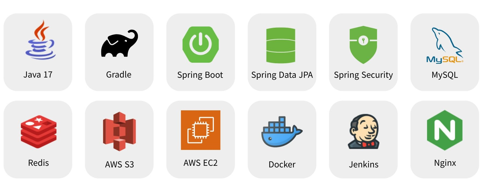

<strong>백엔드 스택</strong>

### ☕ Java 17

최신 LTS 버전의 Java를 기반으로, 높은 성능과 안정성을 갖춘 백엔드 애플리케이션 구현에 활용.  
Record, Switch Expression 등의 현대적인 문법을 통해 코드 가독성과 개발 생산성 향상.

---

### 🚀 Spring Boot 3.4.3

REST API, 스케줄링, 예외 처리, 검증 등의 기능을 빠르고 효율적으로 구현할 수 있도록 지원하는 프레임워크.  
프로젝트 구조와 의존성 관리를 표준화하여 유지보수성 향상.

---

### 🔐 Spring Security

JWT 기반의 인증 및 인가를 위해 커스텀 필터(`CustomAuthenticationFilter`)와 사용자 정의 토큰(`CustomAuthToken`)을 활용하여 보안 처리 구현.

---

### 🧩 Spring Data JPA

객체지향적인 방식으로 DB에 접근하며, 복잡한 쿼리도 메서드 정의만으로 간편하게 처리.

---

### 🗄️ MySQL

대중적이고 안정적인 관계형 데이터베이스.  
다양한 인덱스 전략과 트랜잭션 기능을 활용하여 데이터 정합성과 성능을 확보.  
테이블 간 관계(ERD)를 기반으로 유저-식당-메뉴 간의 구조적 설계 구성.

---

### ⚡ Redis

인증 토큰, 알림 캐시, 인기 맛집 데이터 등의 임시 저장소로 활용.  
빠른 읽기/쓰기 속도를 바탕으로 실시간 사용자 경험 개선.

---

### 🗂️ AWS S3

사용자 커스텀 메뉴 이미지 및 식당 이미지 저장소로 사용.  
`Pre-signed URL`을 통해 보안성을 확보하며, 대용량 정적 파일 업로드/다운로드 처리에 활용.

---

### 📦 Docker

로컬 개발 환경과 배포 환경의 일관성을 확보하기 위해 모든 구성 요소를 컨테이너화하여 관리.

---

### 🔁 Jenkins

GitLab 연동을 통해 자동화된 CI/CD 파이프라인을 구축.  
코드 커밋 시 자동 빌드 및 배포를 통해 개발 효율성과 안정성 강화.

---

### 🌐 Nginx

정적 리소스 제공 및 리버스 프록시 서버로 활용.  
API 요청 라우팅, SSL 인증서 설정, 로드밸런싱 등 웹 서버 최적화 구성에 기여.

### FrontEnd

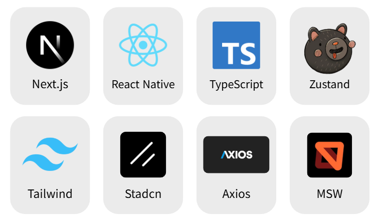

## 🗺️ 기술 아키텍처

## 🚀 프로젝트 소개

**_SSAFY 12기 2학기 공통 프로젝트_**

> ⌛ 프로젝트 기간 : 2025.02.28 ~ 2025.04.11 (6주)

> 📆 상세 기간 : 기획 2주 + 개발 3주 + 버그 해결 1주

###

**😻 NFC 결제** 

## 👥 팀 소개

<table style="text-align: center;" width="100%">
  <tr>
    <th style="text-align: center;" width="16.66%"></th>
    <th style="text-align: center;" width="16.66%"></th>
    <th style="text-align: center;" width="16.66%"></th>
    <th style="text-align: center;" width="16.66%"></th>
    <th style="text-align: center;" width="16.66%"></th>
  </tr>
  <tr>
    <td style="text-align: center;" width="16.66%"><a href="https://github.com/yooniverse7" target="_blank">천세윤(팀장)</a></td>
    <td style="text-align: center;" width="16.66%"><a href="https://github.com/ynghan" target="_blank">정영한</a></td>
    <td style="text-align: center;" width="16.66%"><a href="https://github.com/leesanghyeok523" target="_blank">이상혁</a></td>
    <td style="text-align: center;" width="16.66%"><a href="https://github.com/Steadystudy" target="_blank">민상기</a></td>
    <td style="text-align: center;" width="16.66%"><a href="https://github.com/jinmoon23" target="_blank">최진문</a></td>
  </tr>
<tr>
  <td style="text-align: center; width:16.66%; border-top: solid;">백엔드 개발</td>
  <td style="text-align: center; width:16.66%; border-top: solid;">인프라 개발</td>
  <td style="text-align: center; width:16.66%; border-top: solid;">백엔드 개발</td>
  <td style="text-align: center; width:16.66%; border-top: solid;">프론트 개발</td>
  <td style="text-align: center; width:16.66%; border-top: solid;">프론트 개발</td>
</tr>
  <tr>
    <td style="text-align: center;" width="16.66%">NFC 및 POS</td>
    <td style="text-align: center;" width="16.66%">Jenkins pipeline </td>
    <td style="text-align: center;" width="16.66%">맛집 API</td>
    <td style="text-align: center;" width="16.66%">지도 및 NFC</td>
    <td style="text-align: center;" width="16.66%">React-Native 통신</td>
  </tr>
  <tr>
    <td style="text-align: center;" width="16.66%">결제 API</td>
    <td style="text-align: center;" width="16.66%">OAuth2 Login</td>
    <td style="text-align: center;" width="16.66%">Naver API 크롤링</td>
    <td style="text-align: center;" width="16.66%">QR 결제 담당</td>
    <td style="text-align: center;" width="16.66%">기프티콘 생성</td>
  </tr>
  <tr>
    <td style="text-align: center; width:16.66%; border-bottom: solid;">은행 API</td>
    <td style="text-align: center; width:16.66%; border-bottom: solid;">기프티콘 API</td>
    <td style="text-align: center; width:16.66%; border-bottom: solid;">AI Serving</td>
    <td style="text-align: center; width:16.66%; border-bottom: solid;"></td>
    <td style="text-align: center; width:16.66%; border-bottom: solid;">마이페이지 담당</td>
  </tr>
</table>

## 🚀 주요 기술

### [FE]

-   Next.js: React 기반의 프레임워크, 서버 사이드 렌더링(SSR)과 정적 사이트 생성(SSG)을 활용하여 성능 최적화. RN의 WebView 라이브러리를 통해 웹앱 구현에 활용
-   React-native(RN): : TypeScript와 React를 활용해 Android 네이티브 앱을 개발에 활용. Permission 라이브러리로 필요한 권한 획득 및 핵심 기능인 NFC 결제 기능 구현.
-   TypeScript: 코드의 안정성 및 유지 보수성을 높이는 강력한 타입 시스템 제공
-   React-query: 서버 상태 관리를 위한 라이브러리로, 데이터 페칭, 캐싱, 동기화, 업데이트를 간편하고 효율적으로 처리.
-   Zustand: 간단하고 확장 가능한 클라이언트 상태 관리 라이브러리로, axiosInstance 구성 시 accessToken 전역 상태 관리를 통해 간편한 비동기 통신 구현.
-   TailwindCSS: 유틸리티 클래스 기반 CSS 프레임워크로, 빠르고 일관된 UI 개발에 활용.
-   Shadcn: 기존 컴포넌트 라이브러리와 달리 고유한 "복사 및 붙여넣기" 방식을 채택, 전체 라이브러리를 종속성으로 설치하는 대신 필요한 컴포넌트만 선택적으로 프로젝트에 직접 커스터마이징 및 적용에 활용
-   Axios: Promise 기반의 HTTP 클라이언트 라이브러리로, 비동기 요청과 API 통신을 간편하게 처리.

### [BE]

<strong>생성형 이미지 처리</strong>

-   **목표:**  
    사용자 맞춤 기프티콘 이미지를 생성하고, Amazon S3에 저장하여 클라우드에서 제공하는 서비스 구축.

-   **기술 스택:**
    -   **Stable Diffusion:** 이미지 생성 딥러닝 모델
    -   **GPT-4o (또는 최신 GPT 모델):** 동적 프롬프트 생성을 위한 언어 모델
    -   **FastAPI & LangChain:** API 엔드포인트와 서비스 통합
    -   **PyTorch 최적화:** `torch.float16` 사용 및 4비트 양자화 적용
    -   **Amazon S3:** 생성된 이미지의 클라우드 스토리지

### 초기 문제점

1. **이미지 퀄리티:**

    - 자체 하드코딩된 프롬프트를 사용했을 때 생성되는 이미지의 품질이 낮아, 사용자 만족도가 10장 중 1~2장 정도에 머물렀음.

2. **속도 및 리소스 사용:**
    - GPU 서버에서 실행 중에도 이미지 생성 시간이 90~100초 정도 소요되었고, 모델의 메모리 사용량이 매우 높았음.

### 해결 방안

1. **프롬프트 생성 개선:**

    - **동적 프롬프트 생성:**  
      GPT-4o, FastAPI, LangChain을 활용하여 사용자 입력에 맞는 동적 프롬프트를 생성하도록 변경.
        - 기존 정적인 프롬프트 대신, GPT 기반의 프롬프트 생성으로 사용자 만족도가 10장 중 9~10장으로 향상됨.
    - **캐싱된 프롬프트 파일 활용 (옵션):**  
      비용과 속도 개선을 위해 미리 작성된/캐싱된 프롬프트 파일을 사용하도록 구현 가능 (예: `cached_prompts/prompt_축하.txt`).

2. **모델 최적화:**
    - **데이터 타입 최적화:**
        - 기존 `torch.float32` 대신 `torch.float16` 사용하여 GPU 추론 속도를 향상시키고 메모리 사용량을 줄임.
    - **4비트 양자화:**
        - BitsAndBytes 라이브러리의 `BitsAndBytesConfig`를 사용해 모델의 transformer 부분을 4비트 양자화하여 리소스 사용량을 대폭 줄임.
        - 이를 통해 이미지 생성 시간이 기존의 90~100초에서 10~13초로 단축됨.

### 개선 결과

-   **이미지 생성 속도 개선:**

    -   최적화를 통해 90 ~ 100초였던 생성 시간이 10 ~ 13초로 단축됨.

-   **이미지 품질 향상:**

    -   GPT 기반 동적 프롬프트로 사용자 만족도가 10장 중 1~2장에서 9~10장으로 향상됨.

-   **리소스 효율성 증대:**
    -   `float16`과 4비트 양자화를 적용하여 GPU 메모리 사용량이 감소, 동일 서버에서 더 많은 작업을 동시에 처리할 수 있게 됨.

## 📂 프로젝트 구조

  
<strong>Back 폴더 구조 보기</strong>

  <pre>
📦 main  
 ┣ 📂 java  
 ┃ ┗ 📂 com  
 ┃   ┗ 📂 example  
 ┃     ┗ 📂 ddo_pay  
 ┃       ┣ 📂 client  
 ┃       ┣ 📂 common  
 ┃       ┃ ┣ 📂 config  
 ┃       ┃ ┃ ┣ 📂 redis  
 ┃       ┃ ┃ ┣ 📂 rest  
 ┃       ┃ ┃ ┣ 📂 S3  
 ┃       ┃ ┃ ┗ 📂 security  
 ┃       ┃ ┃   ┗ 📂 token  
 ┃       ┃ ┣ 📂 dto  
 ┃       ┃ ┣ 📂 exception  
 ┃       ┃ ┣ 📂 response  
 ┃       ┃ ┗ 📂 util  
 ┃       ┣ 📂 gift  
 ┃       ┃ ┣ 📂 controller  
 ┃       ┃ ┣ 📂 dto  
 ┃       ┃ ┃ ┣ 📂 create  
 ┃       ┃ ┃ ┣ 📂 select  
 ┃       ┃ ┃ ┗ 📂 update  
 ┃       ┃ ┣ 📂 entity  
 ┃       ┃ ┣ 📂 repository  
 ┃       ┃ ┗ 📂 service  
 ┃       ┃   ┗ 📂 impl  
 ┃       ┣ 📂 pay  
 ┃       ┃ ┣ 📂 controller  
 ┃       ┃ ┣ 📂 dto  
 ┃       ┃ ┃ ┣ 📂 bank_request  
 ┃       ┃ ┃ ┣ 📂 bank_response  
 ┃       ┃ ┃ ┣ 📂 finance  
 ┃       ┃ ┃ ┣ 📂 request  
 ┃       ┃ ┃ ┗ 📂 response  
 ┃       ┃ ┣ 📂 entity  
 ┃       ┃ ┣ 📂 finance_api  
 ┃       ┃ ┣ 📂 repository  
 ┃       ┃ ┗ 📂 service  
 ┃       ┃   ┗ 📂 impl  
 ┃       ┣ 📂 restaurant  
 ┃       ┃ ┣ 📂 controller  
 ┃       ┃ ┣ 📂 dto  
 ┃       ┃ ┃ ┣ 📂 receipt  
 ┃       ┃ ┃ ┣ 📂 request  
 ┃       ┃ ┃ ┗ 📂 response  
 ┃       ┃ ┣ 📂 entity  
 ┃       ┃ ┣ 📂 mapper  
 ┃       ┃ ┣ 📂 repository  
 ┃       ┃ ┗ 📂 service  
 ┃       ┃   ┣ 📂 crawling  
 ┃       ┃   ┣ 📂 impl  
 ┃       ┃   ┗ 📂 receipt  
 ┃       ┃     ┗ 📂 impl  
 ┃       ┣ 📂 sse  
 ┃       ┗ 📂 user  
 ┃         ┣ 📂 controller  
 ┃         ┣ 📂 dto  
 ┃         ┃ ┣ 📂 request  
 ┃         ┃ ┗ 📂 response  
 ┃         ┣ 📂 entity  
 ┃         ┣ 📂 mapper  
 ┃         ┣ 📂 repo  
 ┃         ┗ 📂 service  
 ┃           ┗ 📂 impl  
 ┗ 📂 resources
   ┗ 📂 application.yml

  </pre>

  
<strong>Front - mobile 폴더 구조 보기</strong>

  <pre>
📁 FE/mobile/src
├─📁 features
│  └─📁 contactServices
│      ├─📁 api
│      └─📁 types
└─📁 shared
    └─📁 utils
  </pre>

  
<strong>Front - web 폴더 구조 보기</strong>

  <pre>
📁 FE/web/src
├─📁 app
│  ├─📁 (BarLayout)
│  │  ├─📁 gift
│  │  │  └─📁 get
│  │  │      └─📁 [id]
│  │  └─📁 me
│  │      ├─📁 info
│  │      │  └─📁 setting
│  │      └─📁 stores
│  └─📁 (NoLayout)
│      ├─📁 callback
│      ├─📁 gift
│      │  └─📁 create
│      ├─📁 login
│      ├─📁 moneyCharge
│      ├─📁 pay
│      │  ├─📁 completed
│      │  └─📁 password
│      ├─📁 permission
│      ├─📁 store
│      │  └─📁 register
│      └─📁 user
│          └─📁 firstLogin
├─📁 components
│  └─📁 ui
├─📁 entity
│  ├─📁 gift
│  │  ├─📁 api
│  │  └─📁 model
│  └─📁 store
│      ├─📁 api
│      └─📁 model
├─📁 features
│  ├─📁 crawledStore
│  │  └─📁 ui
│  ├─📁 favoriteStores
│  │  └─📁 ui
│  ├─📁 giftForm
│  │  ├─📁 api
│  │  └─📁 ui
│  ├─📁 gitfBox
│  │  └─📁 ui
│  ├─📁 kakaoLogin
│  │  ├─📁 api
│  │  └─📁 ui
│  ├─📁 map
│  │  ├─📁 model
│  │  └─📁 ui
│  ├─📁 menuForm
│  │  ├─📁 api
│  │  └─📁 ui
│  ├─📁 myMoneyCheck
│  │  ├─📁 api
│  │  └─📁 ui
│  ├─📁 paymentCheck
│  │  ├─📁 api
│  │  └─📁 ui
│  ├─📁 payPwdForm
│  │  ├─📁 api
│  │  └─📁 ui
│  └─📁 permissonRequest
│      └─📁 api
├─📁 lib
├─📁 shared
│  ├─📁 api
│  ├─📁 constants
│  ├─📁 hooks
│  ├─📁 modal
│  ├─📁 msw
│  │  └─📁 mock
│  │      ├─📁 data
│  │      └─📁 handlers
│  ├─📁 reactQuery
│  └─📁 utils
├─📁 store
├─📁 types
└─📁 widgets
    ├─📁 bottomBar
    │  └─📁 ui
    ├─📁 fadeUpContainer
    │  └─📁 ui
    └─📁 searchBar
        └─📁 ui
  </pre>

## 📜 산출물

  
<strong>요구사항 명세서</strong>

  <h3>🔹 유저 및 지도 관리</h3>
  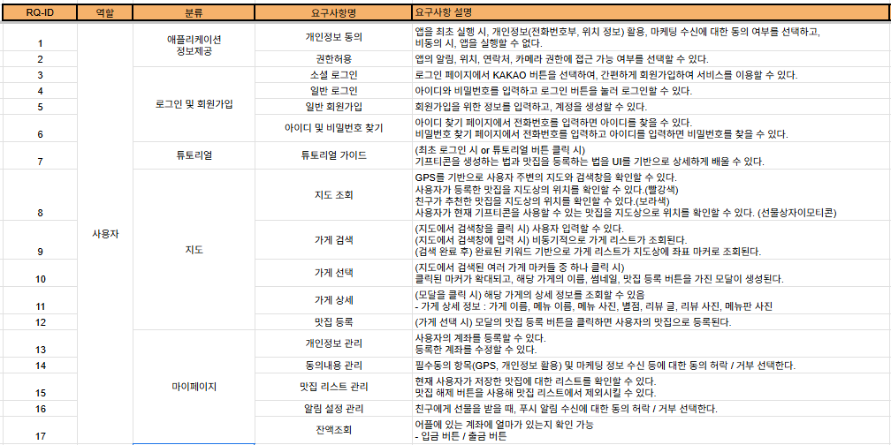
  <h3>🔹 기프티콘 및 친구 관리</h3>
  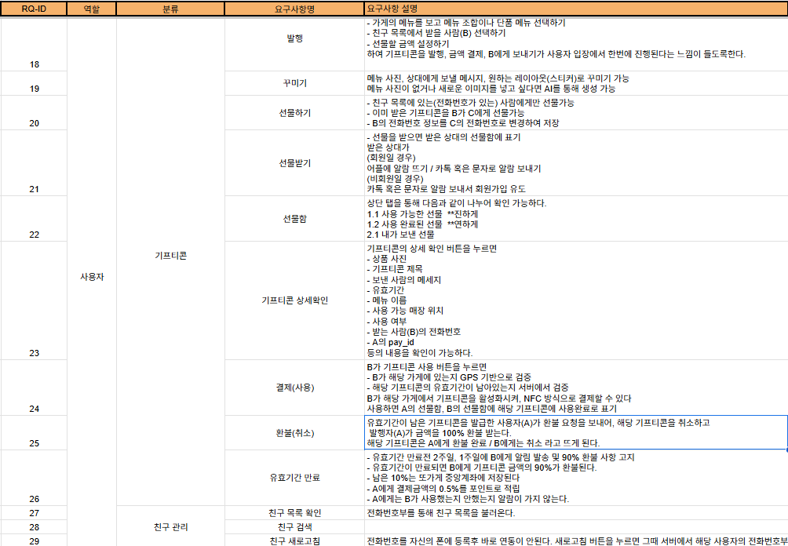

  
<strong>ERD</strong>

  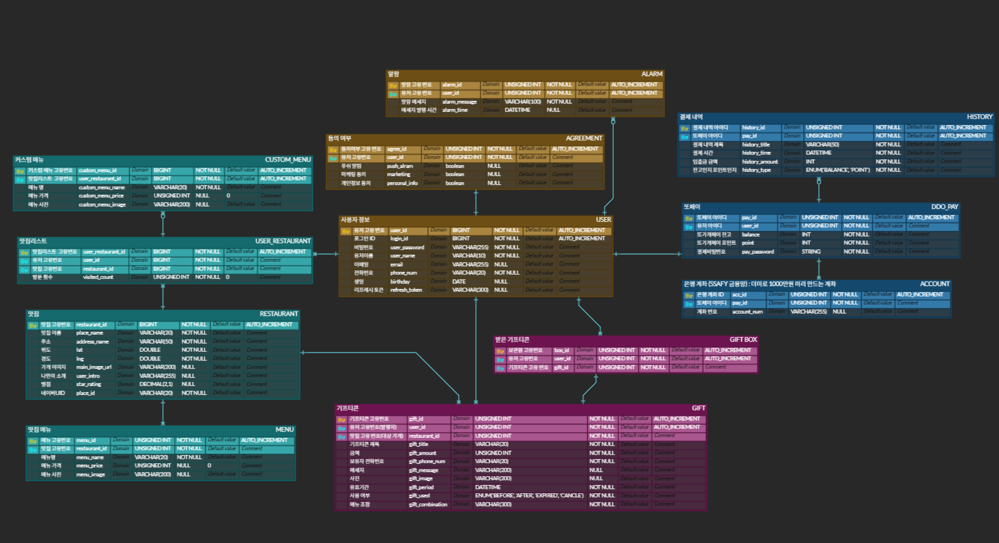

  
<strong>API 명세서</strong>

  <h3>🔹 유저 도메인</h3>
  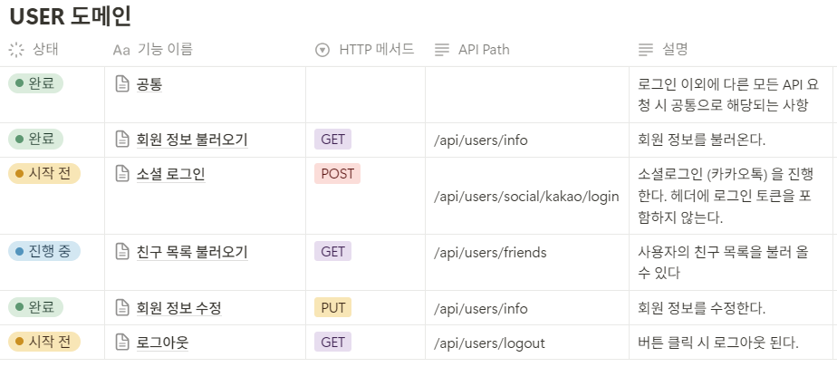
  <h3>🔹 기프티콘 도메인</h3>
  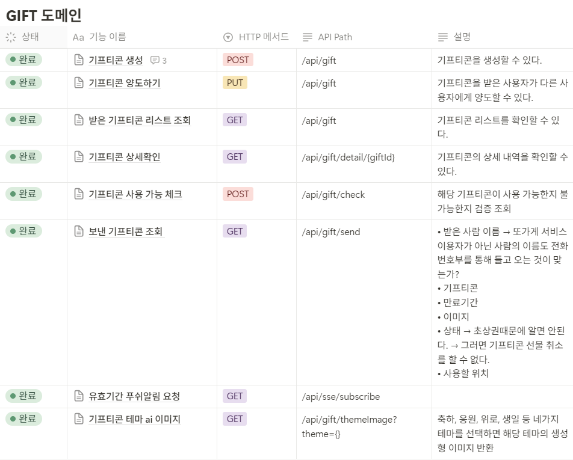
  <h3>🔹 페이 도메인</h3>
  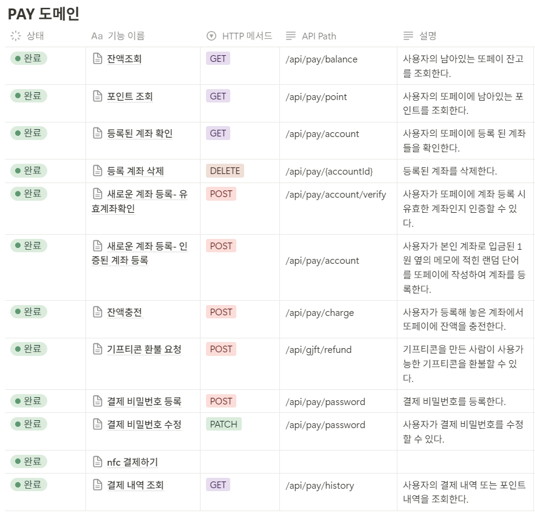
  <h3>🔹 맛집 도메인</h3>
  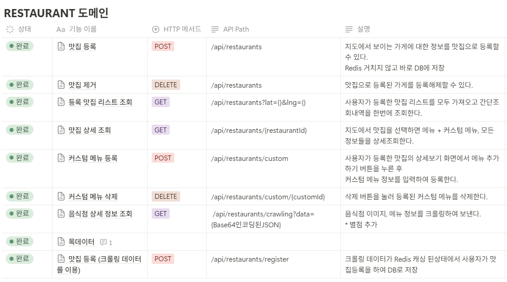
  <h3>🔹 포스 도메인</h3>
  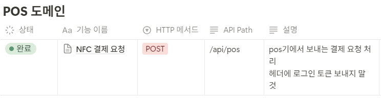
  <h3>🔹 은행 도메인</h3>
  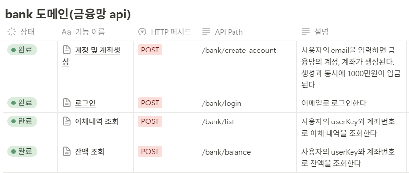

